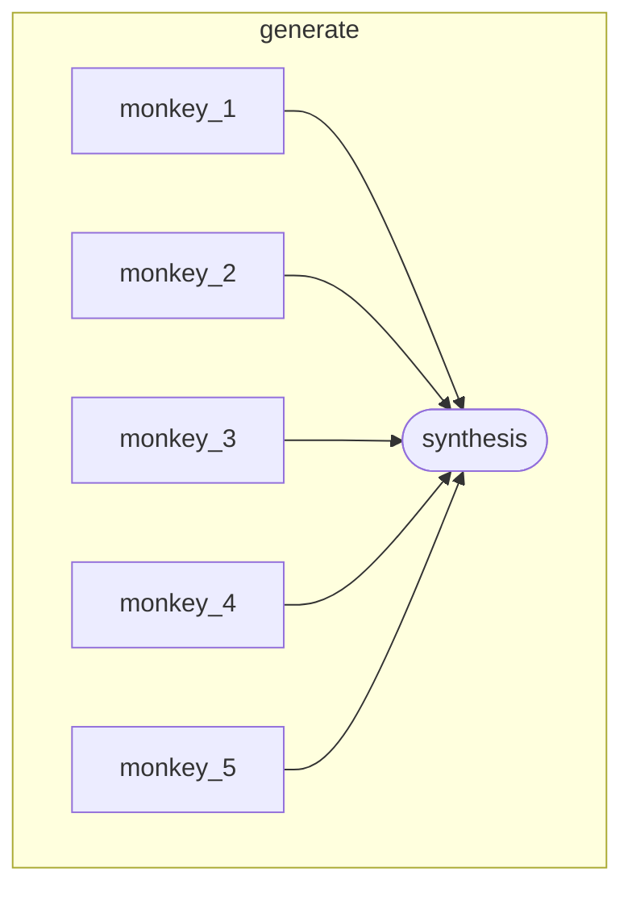

Five agents receive the identical prompt with no coordination. Their outputs diverge because LLMs are nondeterministic. A curator agent then reads all five candidates and selects the strongest one. Run it twice — you'll get different winners.

## What it demonstrates

- `swrm` fan-out: all five agents run concurrently
- `on_failure: continue` — the swrm proceeds even if an individual agent fails
- Synthesis referencing each agent's output via `{{ generate.agents.<id>.output }}`
- Output variance as a feature, not a bug
- Mixing OpenAI and Anthropic within a single swrm node

## Run it

```bash
sirenspec run docs/cookbook/1000-monkeys/workflow.yaml
# Try a different prompt:
sirenspec run docs/cookbook/1000-monkeys/workflow.yaml \
  --input "Write a one-sentence product tagline for a note-taking app."
```

## Workflow

```yaml docs/cookbook/1000-monkeys/workflow.yaml
version: "0.1"

nodes:
  generate:
    type: swrm
    concurrency: 5
    on_failure: continue
    agents:
      - id: monkey_1
        provider: openai
        model: gpt-4o-mini
        prompt: "{{ inputs.message }}"
      - id: monkey_2
        provider: openai
        model: gpt-4o-mini
        prompt: "{{ inputs.message }}"
      - id: monkey_3
        provider: anthropic
        model: claude-haiku-4-5-20251001
        prompt: "{{ inputs.message }}"
      - id: monkey_4
        provider: anthropic
        model: claude-haiku-4-5-20251001
        prompt: "{{ inputs.message }}"
      - id: monkey_5
        provider: openai
        model: gpt-4o-mini
        prompt: "{{ inputs.message }}"

    synthesis:
      provider: anthropic
      model: claude-haiku-4-5-20251001
      prompt: |
        Select the single best candidate response to: {{ inputs.message }}
        Candidates: [1] {{ generate.agents.monkey_1.output }}
                    [2] {{ generate.agents.monkey_2.output }}
                    [3] {{ generate.agents.monkey_3.output }}
                    [4] {{ generate.agents.monkey_4.output }}
                    [5] {{ generate.agents.monkey_5.output }}
        Return the winning response verbatim. No explanation.
```

## Graph



## Next steps

<CardGroup cols={2}>
  <Card title="Market Analysis" href="/cookbook/market-analysis/README">
    Parallel specialists, each with a different task.
  </Card>
  <Card title="Swrm Reference" href="/swrm">
    Full swrm node documentation.
  </Card>
</CardGroup>
