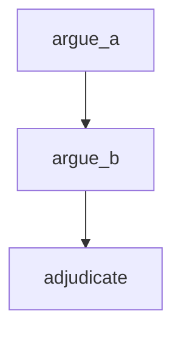

Two agents take opposing positions on any topic you give them. A third agent judges the exchange, scoring each side on clarity, evidence, and persuasiveness. A good stress test for the injection guardrail — adversarial prompts tend to push at boundaries.

## What it demonstrates

- Per-agent `guardrails` overrides (injection on both debaters)
- Sequential edges where each agent builds on accumulated context
- Workflow-level and agent-level guardrail composition
- The injection guardrail under combative, high-stakes prompt conditions

## Run it

```bash
sirenspec run docs/cookbook/adversarial-pair/workflow.yaml
# Pick your own debate topic:
sirenspec run docs/cookbook/adversarial-pair/workflow.yaml \
  --input "REST vs GraphQL"
```

## Workflow

```yaml docs/cookbook/adversarial-pair/workflow.yaml
version: "0.1"

agents:
  side_a:
    model: "openai:gpt-4o-mini"
    system: |
      You are a passionate advocate. Argue forcefully FOR the first position
      implied by the topic in 3-4 sentences. Be direct and use concrete reasoning.
    guardrails:
      - injection

  side_b:
    model: "anthropic:claude-haiku-4-5-20251001"
    system: |
      You are a passionate advocate. Argue forcefully AGAINST the first position
      in 3-4 sentences. Be direct and use concrete reasoning.
    guardrails:
      - injection

  judge:
    model: "anthropic:claude-haiku-4-5-20251001"
    system: |
      You are an impartial debate judge. Score each argument on clarity (1-5),
      evidence (1-5), persuasiveness (1-5). Declare a winner with a one-sentence rationale.

nodes:
  argue_a:
    agent: side_a
    writes: working.argument_a

  argue_b:
    agent: side_b
    writes: working.argument_b

  adjudicate:
    agent: judge
    writes: output.verdict

edges:
  - from: argue_a
    to: argue_b
  - from: argue_b
    to: adjudicate

guardrails:
  - injection
```

## Graph



## Next steps

<CardGroup cols={2}>
  <Card title="Guardrails" href="/guardrails">
    How injection detection and length limits work.
  </Card>
  <Card title="Conditional Pipeline" href="/cookbook/conditional-pipeline/README">
    Route based on agent output using when: expressions.
  </Card>
</CardGroup>
