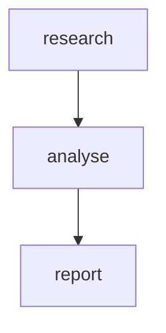

A three-agent research-and-report pipeline with hard ceilings on tokens, cost, and duration. When the ceiling is hit, remaining nodes are skipped instead of running — the workflow finishes with a successful status but partial output. This is the safer default for unattended production workloads.

## What it demonstrates

- The top-level `budget:` block
- `on_exceeded: skip_remaining` — the workflow finishes cleanly instead of crashing
- Per-node `max_tokens_per_call` — each agent's response is independently bounded
- The `budget` block embedded in the run summary, so callers can see how close they came to each ceiling

## Run it

```bash
sirenspec run docs/cookbook/budget-guarded/workflow.yaml --trace
```

The `--trace` flag prints the full JSON trace, including the new `summary.budget` block:

```json
{
  "summary": {
    "total_tokens": 1832,
    "budget": {
      "max_tokens": 4000,
      "max_cost_usd": 0.05,
      "max_duration_s": 120,
      "on_exceeded": "skip_remaining",
      "tokens_used": 1832,
      "estimated_usd": 0.0021,
      "duration_s": 3.514,
      "exceeded": false,
      "violations": [],
      "skipped_remaining": false
    }
  }
}
```

## Workflow

```yaml docs/cookbook/budget-guarded/workflow.yaml
version: "0.1"

budget:
  max_tokens: 4000           # total across all nodes
  max_cost_usd: 0.05         # estimated cost ceiling for the whole run
  max_duration_s: 120        # wall-clock cap for the whole run
  on_exceeded: skip_remaining

agents:
  researcher:
    model: "openai:gpt-4o-mini"
    system: |
      You are a research assistant.  Summarise the topic the user provides in three crisp bullets.

  analyst:
    model: "anthropic:claude-haiku-4-5-20251001"
    system: |
      You are an analyst.  Given a research summary, produce a short list of risks and opportunities.

  reporter:
    model: "anthropic:claude-haiku-4-5-20251001"
    system: |
      You are a reporter.  Combine the research and the analysis into a one-paragraph executive brief.

nodes:
  research:
    agent: researcher
    writes: working.research
    max_tokens_per_call: 500

  analyse:
    agent: analyst
    writes: working.analysis
    max_tokens_per_call: 500

  report:
    agent: reporter
    writes: output.brief
    max_tokens_per_call: 800

edges:
  - from: research
    to: analyse
  - from: analyse
    to: report
```

## `on_exceeded` actions

| Mode               | Behaviour when a ceiling is hit                                        |
| ------------------ | ---------------------------------------------------------------------- |
| `abort`            | The workflow fails with `BudgetExceededError`.                         |
| `warn`             | A warning is logged; execution continues to completion.                |
| `skip_remaining`   | No further LLM calls are made; the run finishes with success status.   |

## Per-node `max_tokens_per_call`

`max_tokens_per_call` is forwarded to the provider as the `max_tokens` API
parameter so the model truncates *its own response*. Combined with the workflow
budget, this gives you two layers of protection: each individual call is bounded
*and* the cumulative spend is bounded.

## Graph



## Next steps

<CardGroup cols={2}>
  <Card title="Content Approval" href="/cookbook/content-approval/README">
    Pause for a human reviewer mid-workflow.
  </Card>
  <Card title="Guardrails" href="/guardrails">
    Per-call guardrails like injection detection and PII redaction.
  </Card>
</CardGroup>
