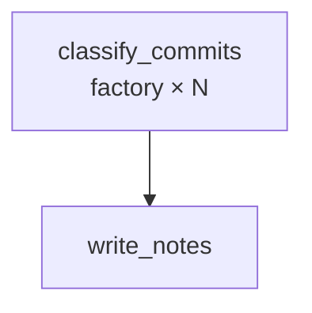

Drop in a JSON array of commit messages and get back polished, grouped release notes. The `factory` node spins up one classifier agent per commit — up to three running concurrently — then a second agent aggregates all the labels into a markdown changelog.

## What it demonstrates

- `factory` node iterating over a runtime list
- `concurrency` to control parallel instance count
- `{{ item }}` and `{{ index }}` loop variables inside factory `inputs`
- Passing a JSON array via `input.message` for the factory's `for_each`
- Chaining factory output into a downstream agent via `{{ classify_commits.output }}`

## Run it

```bash
sirenspec run docs/cookbook/changelog-annotator/workflow.yaml
```

Pass your own commits as a JSON array:

```bash
sirenspec run docs/cookbook/changelog-annotator/workflow.yaml \
  --input '["fix: handle nil user on signup", "feat: dark mode toggle", "chore: migrate to uv"]'
```

## Workflow

```yaml docs/cookbook/changelog-annotator/workflow.yaml
version: "0.1"

agents:
  classifier:
    model: "openai:gpt-4o-mini"
    system: |
      You will receive a git commit message.
      Classify it into exactly one category: bug_fix, feature, chore, or docs.
      Write a single, user-facing sentence summarising what changed.
      Reply in this exact format and nothing else:
      <category>: <summary sentence>

  release_writer:
    model: "anthropic:claude-haiku-4-5-20251001"
    system: |
      You are a technical writer producing release notes from a list of classified commit summaries.
      Each line is formatted as: <category>: <summary>

      Group entries under these markdown headings (omit any group with no entries):
      ## Features
      ## Bug Fixes
      ## Chores
      ## Docs

      Write clean, user-facing bullet points. Keep each bullet concise.

      Commit summaries:
      {{ classify_commits.output }}

nodes:
  classify_commits:
    type: factory
    agent: classifier
    for_each: "{{ inputs.message }}"
    inputs:
      commit: "{{ item }}"
    writes: working.classifications
    concurrency: 3

  write_notes:
    agent: release_writer
    writes: output.release_notes

edges:
  - from: classify_commits
    to: write_notes

guardrails:
  - injection
```

<Note>
`for_each` must resolve to a valid JSON array. Pass commits as a JSON string via `--input` or set `input.message` to a JSON array literal in the workflow file. The factory resolves the string with `json.loads()` at runtime.
</Note>

## How data flows

1. `classify_commits` resolves `for_each: "{{ inputs.message }}"` to a list of commit strings.
2. One `classifier` instance runs per commit (up to 3 concurrently). Each receives `commit: <item>` as its user message and replies with `<category>: <summary>`.
3. All instance outputs are joined into a single newline-separated string at `working.classify_commits.output`.
4. `write_notes` receives that string in its system prompt via `{{ classify_commits.output }}` and groups the entries into structured release notes.

## Graph



## Next steps

<CardGroup cols={2}>
  <Card title="GitHub Issues Triage" href="/cookbook/github-issues-triage/README">
    Factory iterating over live GitHub issues fetched from the API.
  </Card>
  <Card title="1000 Monkeys" href="/cookbook/1000-monkeys/README">
    Swrm fan-out: five agents on the same prompt, curator picks the best.
  </Card>
</CardGroup>
