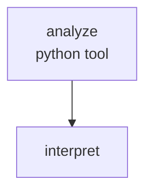

Point at a Python file, get back a structured health report. The `python` tool node calls a local `analyze.py` module that uses the standard library `ast` module to measure line counts, function lengths, and argument complexity — no external dependencies. An LLM then interprets the raw numbers and writes concrete improvement suggestions.

## What it demonstrates

- `python` tool node calling a local module function
- Chaining a tool node to a downstream agent via an edge
- Using `{{ analyze.metrics }}` to pass tool output into an agent system prompt
- Reading from `CODE_HEALTH_FILE` env var for flexible file targeting
- `PYTHONPATH` for importing a recipe-local Python module

## Prerequisites

The `analyze` module lives alongside the workflow. Set `PYTHONPATH` so the runtime can find it:

```bash
export PYTHONPATH=docs/cookbook/code-health-report
```

To analyze your own file instead of the bundled `sample.py`:

```bash
export CODE_HEALTH_FILE=src/myapp/core.py
```

## Run it

```bash
PYTHONPATH=docs/cookbook/code-health-report \
  sirenspec run docs/cookbook/code-health-report/workflow.yaml
```

Analyze your own file:

```bash
CODE_HEALTH_FILE=src/myapp/core.py \
PYTHONPATH=docs/cookbook/code-health-report \
  sirenspec run docs/cookbook/code-health-report/workflow.yaml
```

## Workflow

```yaml docs/cookbook/code-health-report/workflow.yaml
version: "0.1"

agents:
  interpreter:
    model: "openai:gpt-4o-mini"
    system: |
      You are a senior engineer reviewing Python code quality metrics.
      Here are the raw static analysis results for the file:

      {{ analyze.metrics }}

      Write a concise, actionable health report:
      - Identify the top 2-3 concerns based on the numbers
      - Suggest one concrete improvement for each concern
      - Keep the total report under 200 words
      - Use markdown bullet points

nodes:
  analyze:
    type: tool
    tool: python
    config:
      module: analyze
      function: run_analysis
    output_key: metrics

  interpret:
    agent: interpreter
    writes: output.report

edges:
  - from: analyze
    to: interpret

guardrails:
  - injection
```

<Note>
Python tool node `args` are not template-interpolated — they are passed as-is to the function. The `run_analysis` function reads `CODE_HEALTH_FILE` directly from `os.environ`, which is why no `args` are needed here.
</Note>

## How data flows

1. `analyze` calls `analyze.run_analysis()` from the local module. The function reads a Python source file, parses it with `ast`, and returns a metrics dict (line counts, function count, average function length, max argument count).
2. The result is written to `working.analyze.metrics`.
3. `interpret` resolves `{{ analyze.metrics }}` in its system prompt and generates the health report.

## Graph



## Next steps

<CardGroup cols={2}>
  <Card title="Tool Nodes" href="/tool-nodes">
    Full HTTP and Python tool node reference, including module resolution and error handling.
  </Card>
  <Card title="Blind Code Review" href="/cookbook/blind-code-review/README">
    Multi-turn refinement: write code, review it, then revise — without the reviewer seeing the spec.
  </Card>
</CardGroup>
