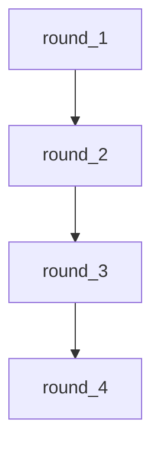

A long passage is compressed four times in sequence, each agent targeting half the word count of its input. Watch how meaning is preserved, simplified, or lost across rounds — and observe the `length` guardrail firing when an agent produces output that exceeds the limit.

## What it demonstrates

- The `length` guardrail applied to every hop in a chain
- Reusing a single agent definition (`summarizer`) across four nodes
- How context accumulates: each hop's output is visible in the trace as `working.round_N`
- Emergent behaviour: meaning collapse is gradual, then sudden

## Run it

```bash
sirenspec run docs/cookbook/compression-gauntlet/workflow.yaml
# Try your own document:
sirenspec run docs/cookbook/compression-gauntlet/workflow.yaml \
  --input "A long passage of your choice (150+ words works best)."
```

Check `working.round_1` through `working.round_3` in the trace alongside `output.final` to see compression at each stage.

## Workflow

```yaml docs/cookbook/compression-gauntlet/workflow.yaml
version: "0.1"

agents:
  summarizer:
    model: "openai:gpt-4o-mini"
    system: |
      You are a ruthless editor. Rewrite the passage at exactly half the word count
      of the input. Preserve the most important facts. Drop examples and qualifiers first.
    guardrails:
      - length

nodes:
  round_1:
    agent: summarizer
    writes: working.round_1
  round_2:
    agent: summarizer
    writes: working.round_2
  round_3:
    agent: summarizer
    writes: working.round_3
  round_4:
    agent: summarizer
    writes: output.final

edges:
  - from: round_1
    to: round_2
  - from: round_2
    to: round_3
  - from: round_3
    to: round_4

guardrails:
  - injection
  - length
```

## Graph



## Next steps

<CardGroup cols={2}>
  <Card title="Telephone Game" href="/cookbook/telephone-game">
    Five agents relay a message — watch drift without compression.
  </Card>
  <Card title="Guardrails" href="/guardrails">
    How the length guardrail works and how to configure it.
  </Card>
</CardGroup>
