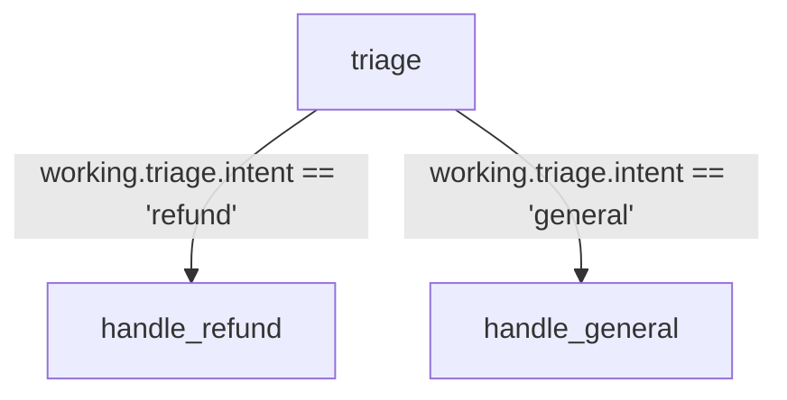

A triage agent classifies the user's intent, then conditional edges activate exactly one of two downstream handlers. The other node is silently skipped. Only the matching branch executes per run.

## What it demonstrates

- Conditional edges with `when:` expressions
- Writing to a nested `working.*` path (`working.triage.intent`)
- Safe expression evaluation — only `working` and `output` are in scope
- Branching without duplicating agent definitions

## Run it

```bash
# Triggers handle_refund
sirenspec run docs/cookbook/conditional-pipeline/workflow.yaml --input "I want a refund on my last order"

# Triggers handle_general
sirenspec run docs/cookbook/conditional-pipeline/workflow.yaml --input "What are your store hours?"
```

## Workflow

```yaml docs/cookbook/conditional-pipeline/workflow.yaml
version: "0.1"

agents:
  triage_agent:
    model: "openai:gpt-4o-mini"
    system: |
      Classify the user's message as either a refund request or a general enquiry.
      Reply with ONLY one word — either "refund" or "general" — and nothing else.

  refund_handler:
    model: "openai:gpt-4o-mini"
    system: |
      You are a customer-support specialist handling refund requests.
      Acknowledge the request warmly, outline the refund process in two or three
      sentences, and let the customer know how long it typically takes.

  general_handler:
    model: "openai:gpt-4o-mini"
    system: |
      You are a helpful customer-support agent.
      Answer the user's question clearly and concisely in two or three sentences.

nodes:
  triage:
    agent: triage_agent
    writes: working.triage.intent

  handle_refund:
    agent: refund_handler
    writes: output.reply

  handle_general:
    agent: general_handler
    writes: output.reply

edges:
  - from: triage
    to: handle_refund
    when: working.triage.intent == "refund"

  - from: triage
    to: handle_general
    when: working.triage.intent == "general"

guardrails:
  - injection
  - length
```

## How branching works

After `triage` writes its one-word label to `working.triage.intent`, the executor evaluates both outgoing `when:` expressions. Only the matching node runs. If neither expression matches (e.g. the LLM returns an unexpected label), both nodes are skipped and `output.reply` is never written.

<Warning>
`when:` expressions run in a sandboxed namespace. Only `working` and `output` are available — no built-ins, no imports. Evaluation errors are treated as `False` and the edge is silently skipped.
</Warning>

## Graph



## Next steps

<CardGroup cols={2}>
  <Card title="Adversarial Pair" href="/docs/cookbook/adversarial-pair/README">
    Two agents take opposing sides; a judge scores the debate.
  </Card>
  <Card title="YAML Reference" href="/docs/yaml-reference">
    Full edge and when: expression syntax.
  </Card>
</CardGroup>
