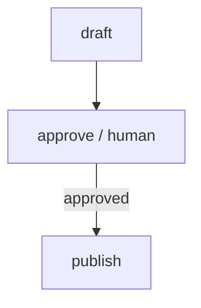

A draft is generated, the workflow pauses to ask the operator to approve it, and only then does the publisher run. This is the canonical human-in-the-loop pattern: an autonomous pipeline with one explicit gate where a human decides whether to continue.

## What it demonstrates

- The `human` node type (new in v0.1.x)
- Resolving `{{ draft.output }}` inside the prompt shown to the operator
- A `when:` edge that only routes to `publish` if the human answered `"yes"`
- `timeout` + `on_timeout: use_default` so an unattended workflow doesn't hang forever

## Run it

```bash
sirenspec run docs/cookbook/content-approval/workflow.yaml \
  --input "A weekend launch announcement for our new YAML-first agent SDK."
```

The CLI will print the draft, then block on stdin. Type `yes` to publish or `no` to reject.

## Workflow

```yaml docs/cookbook/content-approval/workflow.yaml
version: "0.1"

agents:
  drafter:
    model: "openai:gpt-4o-mini"
    system: |
      You are a marketing copywriter.  Draft a short, punchy social media post
      about the topic the user provides.  Return only the post text — no preamble.

  publisher:
    model: "anthropic:claude-haiku-4-5-20251001"
    system: |
      You are the publishing assistant.  Format the approved draft into a final
      post with a one-line caption and 3 hashtags.

nodes:
  draft:
    agent: drafter
    writes: working.draft

  approve:
    type: human
    prompt: |
      Draft to review:
      ---
      {{ draft.output }}
      ---
      Reply 'yes' to publish, 'no' to reject, or any text to edit (free-form).
    writes: working.approval
    timeout: 600          # 10 minutes
    on_timeout: use_default
    default_output: "no"

  publish:
    agent: publisher
    writes: output.post

edges:
  - from: draft
    to: approve
  - from: approve
    to: publish
    when: 'working.approval == "yes"'
```

<Note>
`human` nodes consume no LLM tokens.  They block on stdin (or any caller-supplied
input function), and the operator's response is written to the workflow context
just like an agent's output — so downstream `when:` conditions, prompt interpolation,
and writes paths all work identically.
</Note>

## Timeout semantics

| `on_timeout`    | Behaviour when the timeout fires                                    |
| --------------- | ------------------------------------------------------------------- |
| `abort`         | The workflow fails with a `HumanInputError`.                        |
| `skip`          | The empty string is written and execution continues.                |
| `use_default`   | `default_output` is written and execution continues.                |

Setting `on_timeout: use_default` with `default_output: "no"` (as above) makes the
workflow fail-closed: an unattended pipeline never auto-publishes.

## Graph



## Next steps

<CardGroup cols={2}>
  <Card title="Budget Guarded" href="/cookbook/budget-guarded/README">
    Cap a workflow's total spend with the `budget:` block.
  </Card>
  <Card title="Conditional Pipeline" href="/cookbook/conditional-pipeline/README">
    Route to different handlers based on an LLM classification.
  </Card>
</CardGroup>
