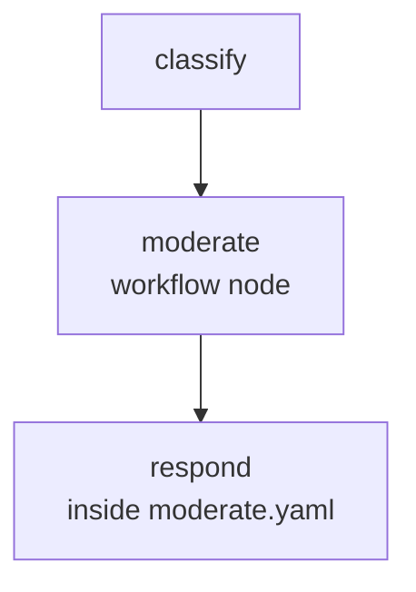

A two-layer workflow: the outer workflow classifies user-submitted content as `safe`, `borderline`, or `harmful`, then hands off to a nested `moderate.yaml` child workflow that applies injection and PII guardrails and generates the appropriate response. This pattern separates the routing decision from the response logic — each can evolve independently.

## What it demonstrates

- `workflow` node executing a sub-workflow inline
- Context isolation: child workflow receives only the keys declared in `inputs`
- `{{ inputs.classification }}` inside a child workflow's system prompt
- Layering guardrails across parent and child workflows
- `pii` guardrail applied at both levels

## Run it

```bash
sirenspec run docs/cookbook/content-moderation-pipeline/workflow.yaml
```

Test a borderline input:

```bash
sirenspec run docs/cookbook/content-moderation-pipeline/workflow.yaml \
  --input "How do I pick a lock if I'm locked out of my house?"
```

## Workflow

**Parent** (`workflow.yaml`):

```yaml docs/cookbook/content-moderation-pipeline/workflow.yaml
version: "0.1"

agents:
  classifier:
    model: "openai:gpt-4o-mini"
    system: |
      Classify the following content as exactly one of: safe, borderline, or harmful.
      Reply with ONLY one word.

nodes:
  classify:
    agent: classifier
    writes: working.content_class

  moderate:
    type: workflow
    ref: ./docs/cookbook/content-moderation-pipeline/moderate.yaml
    inputs:
      classification: "{{ classify.output }}"
    writes: output.moderated

edges:
  - from: classify
    to: moderate

guardrails:
  - injection
  - pii
```

**Child** (`moderate.yaml`):

```yaml docs/cookbook/content-moderation-pipeline/moderate.yaml
version: "0.1"

agents:
  responder:
    model: "anthropic:claude-haiku-4-5-20251001"
    system: |
      Content classification: {{ inputs.classification }}

      You will receive user-submitted content. Respond based on the classification:
      - safe: answer helpfully in 2-3 sentences.
      - borderline: add a brief one-sentence content warning, then respond carefully.
      - harmful: politely decline in one sentence and explain why you cannot help.

nodes:
  respond:
    agent: responder
    writes: output.reply

guardrails:
  - injection
  - pii
```

<Note>
The child workflow's context starts fresh — it only sees the keys declared in the parent's `inputs` block. The original user message is passed through as the user input automatically; only additional context (like `classification`) needs to be forwarded explicitly.
</Note>

## How data flows

1. `classify` receives the user's message and writes a single word (`safe`, `borderline`, or `harmful`) to `working.classify.output`.
2. The `moderate` workflow node resolves `inputs.classification` from `{{ classify.output }}` and launches `moderate.yaml` with a clean context containing only that value.
3. Inside `moderate.yaml`, `responder` reads `{{ inputs.classification }}` from its system prompt and generates the appropriate response.
4. The child workflow's `output` dict is written back into the parent at `output.moderated`.

## Graph



## Next steps

<CardGroup cols={2}>
  <Card title="Workflow Nodes" href="/workflow-nodes">
    Full reference for sub-workflow composition, context isolation, and the registry API.
  </Card>
  <Card title="Guardrails" href="/guardrails">
    Injection, PII, length, schema, and cost-cap guardrail documentation.
  </Card>
</CardGroup>
