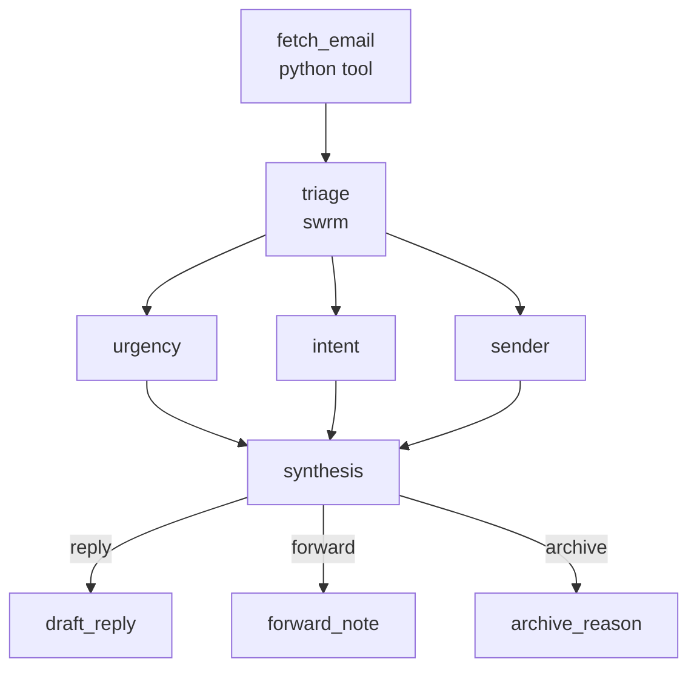

Connect to Gmail and let SirenSpec triage your inbox. A Python tool fetches the most recent unread message, then a `swrm` runs three classifiers simultaneously — urgency score, intent label, and sender reputation. The synthesis agent combines those signals into a routing decision, and conditional edges send the workflow to whichever response agent fits: draft a reply, write a forwarding note, or generate an archive reason.

## What it demonstrates

- `python` tool node making authenticated multi-step API calls
- `swrm` running three parallel classifiers on the same input
- Synthesis agent combining swrm outputs into a single routing decision
- Conditional edges routing on `working.triage.output`
- `pii` guardrail protecting email content throughout

## Prerequisites

Obtain a Gmail OAuth 2.0 access token with `gmail.readonly` scope:

```bash
export GMAIL_ACCESS_TOKEN=ya29...
```

The `email_fetcher` module lives alongside the workflow:

```bash
export PYTHONPATH=docs/cookbook/email-triage
```

## Run it

```bash
PYTHONPATH=docs/cookbook/email-triage \
  sirenspec run docs/cookbook/email-triage/workflow.yaml
```

## Workflow

```yaml docs/cookbook/email-triage/workflow.yaml
version: "0.1"

agents:
  drafter:
    model: "anthropic:claude-haiku-4-5-20251001"
    system: |
      Draft a concise, professional reply to this email in 2-3 sentences.
      Email: {{ fetch_email.email_json }}

  forwarder:
    model: "openai:gpt-4o-mini"
    system: |
      Write a single-sentence forwarding note explaining why this email
      needs attention from a team member.
      Email: {{ fetch_email.email_json }}

  archiver:
    model: "openai:gpt-4o-mini"
    system: |
      Write a one-line archive reason for this email.
      Email: {{ fetch_email.email_json }}

nodes:
  fetch_email:
    type: tool
    tool: python
    config:
      module: email_fetcher
      function: fetch_latest_unread
    output_key: email_json

  triage:
    type: swrm
    concurrency: 3
    agents:
      - id: urgency
        provider: openai
        model: gpt-4o-mini
        prompt: |
          Rate the urgency of this email from 1 (low) to 5 (critical).
          Reply with ONLY a single integer.
          Email: {{ fetch_email.email_json }}

      - id: intent
        provider: openai
        model: gpt-4o-mini
        prompt: |
          Classify the intent: action_required, fyi, question, or spam.
          Reply with ONLY one of those four words.
          Email: {{ fetch_email.email_json }}

      - id: sender
        provider: anthropic
        model: claude-haiku-4-5-20251001
        prompt: |
          Rate the sender's reputation as: trusted, neutral, or unknown.
          Reply with ONLY one of those three words.
          Email: {{ fetch_email.email_json }}

    synthesis:
      provider: openai
      model: gpt-4o-mini
      prompt: |
        Given these triage scores for an email:
          urgency (1-5): {{ triage.agents.urgency.output }}
          intent:        {{ triage.agents.intent.output }}
          sender:        {{ triage.agents.sender.output }}

        Decide the routing action. Reply with ONLY one word: reply, forward, or archive.

  draft_reply:
    agent: drafter
    writes: output.draft

  forward_note:
    agent: forwarder
    writes: output.forward

  archive_reason:
    agent: archiver
    writes: output.archive

edges:
  - from: fetch_email
    to: triage
  - from: triage
    to: draft_reply
    when: working.triage.output == "reply"
  - from: triage
    to: forward_note
    when: working.triage.output == "forward"
  - from: triage
    to: archive_reason
    when: working.triage.output == "archive"

guardrails:
  - injection
  - pii
```

## How data flows

1. `fetch_email` calls `email_fetcher.fetch_latest_unread()`, which returns a JSON string with `from`, `subject`, and `snippet`.
2. `triage` fans out to three agents simultaneously. Each reads `{{ fetch_email.email_json }}` and produces a single score word.
3. The synthesis agent combines all three signals and outputs one of `reply`, `forward`, or `archive`.
4. The synthesis output is written to `working.triage.output`. Conditional edges route to exactly one of `draft_reply`, `forward_note`, or `archive_reason`.

## Graph



## Next steps

<CardGroup cols={2}>
  <Card title="Market Analysis" href="/cookbook/market-analysis/README">
    Swrm of specialist analysts with a synthesis agent — the core parallel pattern.
  </Card>
  <Card title="Conditional Pipeline" href="/cookbook/conditional-pipeline/README">
    Simpler conditional routing without swrm.
  </Card>
</CardGroup>
