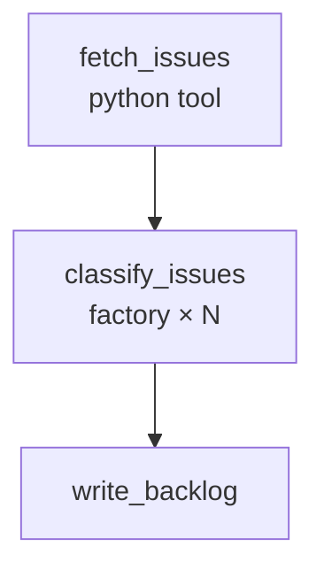

Connect to any GitHub repo and get a prioritized backlog in seconds. A Python tool fetches the ten most recent open issues and serializes them for the factory node, which classifies each one (P0–P3) with suggested labels and a triage note — up to three running concurrently. A final agent rolls everything into a markdown table grouped by priority.

## What it demonstrates

- `python` tool node fetching live data from an external API
- `factory` node iterating over a dynamically-fetched list
- Returning a JSON string from a Python tool so `for_each` can parse it
- `concurrency` controlling parallel factory instances
- Chaining tool → factory → agent in a three-node sequential pipeline

## Prerequisites

```bash
export GITHUB_TOKEN=ghp_...       # classic PAT with repo:read scope
export GITHUB_REPO=owner/repo     # e.g. sirenspec/sirenspec
```

The `triage` module lives alongside the workflow:

```bash
export PYTHONPATH=docs/cookbook/github-issues-triage
```

## Run it

```bash
PYTHONPATH=docs/cookbook/github-issues-triage \
  sirenspec run docs/cookbook/github-issues-triage/workflow.yaml
```

## Workflow

```yaml docs/cookbook/github-issues-triage/workflow.yaml
version: "0.1"

agents:
  classifier:
    model: "openai:gpt-4o-mini"
    system: |
      You are a senior engineer triaging a GitHub issue.
      Return a JSON object with these exact fields:
        priority    — one of: P0, P1, P2, P3
        labels      — list of up to 3 relevant labels (e.g. "bug", "auth", "perf")
        triage_note — one sentence explaining the priority decision

      Return ONLY valid JSON. No explanation, no markdown fences.

      Issue:
      {{ inputs.issue }}

  backlog_writer:
    model: "anthropic:claude-haiku-4-5-20251001"
    system: |
      You are a technical project manager.
      Each line below is a classified GitHub issue as JSON.
      Group them by priority (P0 → P3) using markdown tables with columns:
      | Issue | Priority | Labels | Triage Note |

      Omit any priority group with no entries.

      Classifications:
      {{ classify_issues.output }}

nodes:
  fetch_issues:
    type: tool
    tool: python
    config:
      module: triage
      function: fetch_issues_as_list
    output_key: issues_json

  classify_issues:
    type: factory
    agent: classifier
    for_each: "{{ fetch_issues.issues_json }}"
    inputs:
      issue: "{{ item }}"
    writes: working.classifications
    concurrency: 3

  write_backlog:
    agent: backlog_writer
    writes: output.backlog

edges:
  - from: fetch_issues
    to: classify_issues
  - from: classify_issues
    to: write_backlog

guardrails:
  - injection
```

<Note>
The HTTP tool adapter parses JSON responses into Python objects, which can't be passed directly to `for_each` (it expects a JSON string). The `triage.py` module handles fetching and returns `json.dumps(list)` so the factory receives a valid JSON array.
</Note>

## How data flows

1. `fetch_issues` calls `triage.fetch_issues_as_list()`, which fetches issues from the GitHub API and returns a JSON array of formatted strings (one per issue).
2. `classify_issues` resolves `for_each` to that list, spawning one classifier per issue (up to 3 concurrently). Each receives the issue text and returns a JSON triage object.
3. All classifier outputs are joined at `working.classify_issues.output`.
4. `write_backlog` reads all classifications and produces a prioritized markdown table.

## Graph



## Next steps

<CardGroup cols={2}>
  <Card title="Changelog Annotator" href="/cookbook/changelog-annotator/README">
    Factory over a static commit list — the self-contained factory showcase.
  </Card>
  <Card title="PR Summarizer" href="/cookbook/pr-summarizer/README">
    HTTP tool fetching a GitHub diff directly, without a Python wrapper.
  </Card>
</CardGroup>
