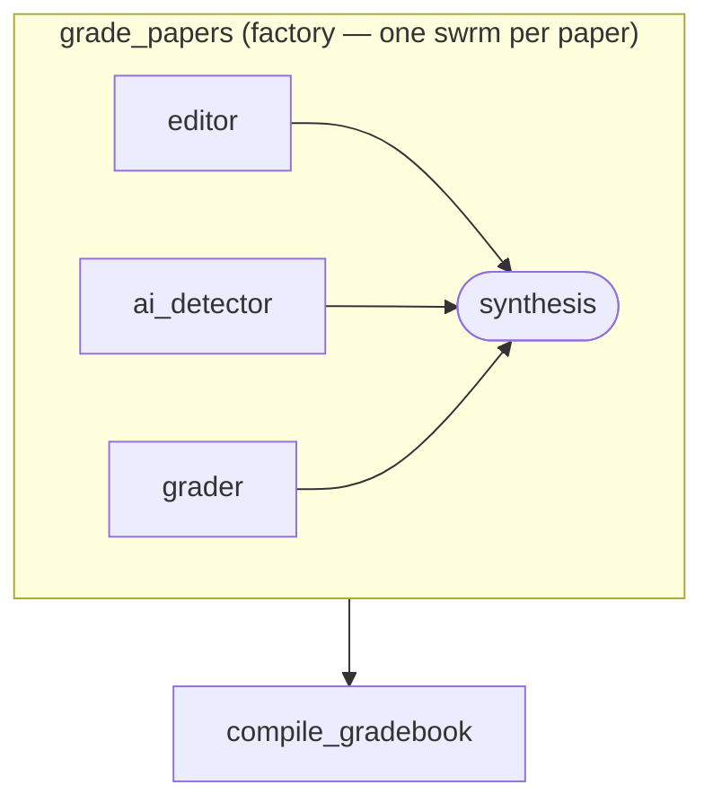

A professor uploads N student papers. Each paper gets its own swrm: three specialist agents run concurrently (editor, AI detector, grader), and a synthesis step folds their verdicts into a single grade report. The factory collects all N reports; a gradebook compiler assembles the final markdown table.

This is the **swrm factory** pattern — every `for_each` item spawns a complete mini-swrm, not just a single agent.

## What it demonstrates

- `FactoryNode.swrm` — each item in `for_each` spawns a full swrm instead of a single agent
- `{{ item }}` / `{{ index }}` / `{{ total }}` inside swrm agent prompts and the synthesis prompt
- Per-item synthesis: each paper gets its own grade report before results are collected
- `on_failure: continue` — a single bad paper does not abort the rest of the batch
- `concurrency: 3` — at most 3 papers graded simultaneously, each paper's 3 agents run fully in parallel

## Run it

```bash
sirenspec run docs/cookbook/grading-factory/workflow.yaml
# Pass your own papers as a JSON array:
sirenspec run docs/cookbook/grading-factory/workflow.yaml \
  --input '["Paper one text here.", "Paper two text here."]'
```

## Workflow

```yaml docs/cookbook/grading-factory/workflow.yaml
version: "0.1"

agents:
  gradebook_compiler:
    model: "anthropic:claude-haiku-4-5-20251001"
    system: |
      Compile the individual grade reports into a markdown gradebook.
      Reports: {{ grade_papers.output }}

nodes:
  grade_papers:
    type: factory
    for_each: "{{ inputs.message }}"
    concurrency: 3
    on_failure: continue
    writes: working.grade_reports
    swrm:
      concurrency: 3
      agents:
        - id: editor
          provider: anthropic
          model: claude-haiku-4-5-20251001
          prompt: "Review paper {{ index }} of {{ total }}: {{ item }}"
        - id: ai_detector
          provider: openai
          model: gpt-4o-mini
          prompt: "Assess AI likelihood for paper {{ index }} of {{ total }}: {{ item }}"
        - id: grader
          provider: anthropic
          model: claude-haiku-4-5-20251001
          prompt: "Grade paper {{ index }} of {{ total }}: {{ item }}"
      synthesis:
        provider: anthropic
        model: claude-haiku-4-5-20251001
        prompt: |
          Produce a grade report for paper {{ index }} of {{ total }}.
          Editor: {{ grade_papers.agents.editor.output }}
          AI check: {{ grade_papers.agents.ai_detector.output }}
          Grade: {{ grade_papers.agents.grader.output }}

  compile_gradebook:
    agent: gradebook_compiler
    writes: output.gradebook

edges:
  - from: grade_papers
    to: compile_gradebook
```

## Graph



## How the swrm factory works

For a batch of 3 papers, the executor runs:

```
Paper 0 → [editor, ai_detector, grader] → synthesis → grade report 0
Paper 1 → [editor, ai_detector, grader] → synthesis → grade report 1
Paper 2 → [editor, ai_detector, grader] → synthesis → grade report 2
                                                ↓
                                      compile_gradebook
```

Up to `concurrency: 3` papers run simultaneously. Within each paper, all three swrm agents run fully in parallel. The synthesis step fires once all three agents for that paper have finished. The factory's `writes` path receives the collected list of per-paper grade reports.

## Next steps

<CardGroup cols={2}>
  <Card title="1000 Monkeys" href="/cookbook/1000-monkeys/README">
    Pure swrm fan-out: the same prompt sent to N agents simultaneously.
  </Card>
  <Card title="GitHub Issues Triage" href="/cookbook/github-issues-triage/README">
    Classic factory with a single agent per item.
  </Card>
  <Card title="Factory Reference" href="/yaml-reference">
    Full FactoryNode YAML reference including swrm mode.
  </Card>
  <Card title="Swrm Reference" href="/swrm">
    Full swrm node documentation.
  </Card>
</CardGroup>
