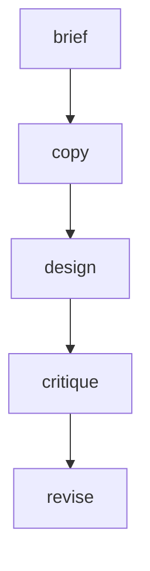

The longest sequential recipe in the cookbook. A creative director writes a brand brief, a copywriter drafts landing page copy, a designer produces HTML/CSS from that copy, a critic reviews the output, and a final editor applies the improvements. Every agent builds on the full accumulated context from all prior nodes.

## What it demonstrates

- A five-node pipeline — the longest sequential chain in the cookbook
- Deep `working.*` context accumulation across every step
- Multi-modal output types (text briefs, marketing copy, raw HTML)
- Critique and revision as explicit nodes, not implicit LLM behavior
- How context from early nodes (the brief) remains available to late nodes (the final editor)

## Run it

```bash
sirenspec run docs/cookbook/graphic-design-firm/workflow.yaml
# Try a different product:
sirenspec run docs/cookbook/graphic-design-firm/workflow.yaml \
  --input "A meditation app called Stillwater for busy professionals."
```

The `output.final_html` key in the trace contains renderable HTML. Paste it into a browser to see the result.

## Workflow

```yaml docs/cookbook/graphic-design-firm/workflow.yaml
version: "0.1"

agents:
  creative_director:
    model: "anthropic:claude-haiku-4-5-20251001"
    system: |
      Write a one-page creative brief: brand voice (3 adjectives), target audience
      (one sentence), value proposition (one sentence), visual direction.

  copywriter:
    model: "openai:gpt-4o-mini"
    system: |
      From the creative brief, write hero section copy:
      headline (max 8 words), subheadline (max 20 words), three CTA labels.

  designer:
    model: "openai:gpt-4o-mini"
    system: |
      Write the HTML and inline CSS for the hero section using the brand colours
      from the brief and the copy provided. Return only the HTML.

  critic:
    model: "anthropic:claude-haiku-4-5-20251001"
    system: |
      Review the hero section against the brief. Give three specific improvement
      suggestions: one for copy, one for layout, one for visual design.

  final_editor:
    model: "anthropic:claude-haiku-4-5-20251001"
    system: |
      Apply the copy and layout suggestions from the critic to the HTML.
      Return only the revised HTML.

nodes:
  brief:
    agent: creative_director
    writes: working.brief
  copy:
    agent: copywriter
    writes: working.copy
  design:
    agent: designer
    writes: working.html
  critique:
    agent: critic
    writes: working.critique
  revise:
    agent: final_editor
    writes: output.final_html

edges:
  - from: brief
    to: copy
  - from: copy
    to: design
  - from: design
    to: critique
  - from: critique
    to: revise

guardrails:
  - injection
  - length
```

## Graph



## Next steps

<CardGroup cols={2}>
  <Card title="Blind Code Review" href="/docs/cookbook/blind-code-review/README">
    The same write-review-revise pattern applied to code.
  </Card>
  <Card title="News Desk" href="/docs/cookbook/news-desk/README">
    A four-agent editorial pipeline with a similar handoff structure.
  </Card>
</CardGroup>
