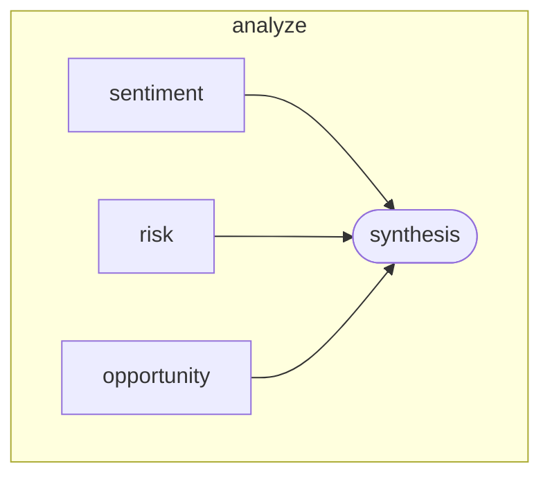

Three agents run concurrently against the same market report — one reads sentiment, one identifies risks, one surfaces opportunities. A synthesis agent then combines all three analyses into a final recommendation. This is the committee-of-experts pattern.

## What it demonstrates

- `swrm` node type for parallel agent fan-out
- `concurrency` limit controlling how many agents run simultaneously
- Per-agent `provider` and `model` overrides within a swrm
- `synthesis` block that references individual agent outputs via `{{ swrm_node.agents.<id>.output }}`
- Mixing OpenAI and Anthropic within a single node

## Run it

```bash
sirenspec run docs/cookbook/market-analysis/workflow.yaml
sirenspec run docs/cookbook/market-analysis/workflow.yaml \
  --input "Q3 revenue missed estimates by 8%. Margins compressed due to supply chain costs. Management guided for recovery in H1 next year."
```

## Workflow

```yaml docs/cookbook/market-analysis/workflow.yaml
version: "0.1"

nodes:
  analyze:
    type: swrm
    concurrency: 3
    on_failure: abort
    agents:
      - id: sentiment
        provider: openai
        model: gpt-4o-mini
        prompt: |
          Analyze the market sentiment expressed in this report and summarise it
          in two to three sentences.
          Report: {{ inputs.message }}

      - id: risk
        provider: anthropic
        model: claude-haiku-4-5-20251001
        prompt: |
          Identify the top three risks mentioned or implied in this report.
          Return a numbered list.
          Report: {{ inputs.message }}

      - id: opportunity
        provider: openai
        model: gpt-4o-mini
        prompt: |
          Find the top three investment opportunities mentioned or implied in
          this report. Return a numbered list.
          Report: {{ inputs.message }}

    synthesis:
      provider: anthropic
      model: claude-haiku-4-5-20251001
      prompt: |
        Sentiment: {{ analyze.agents.sentiment.output }}
        Risk: {{ analyze.agents.risk.output }}
        Opportunity: {{ analyze.agents.opportunity.output }}
        Produce a final 3-paragraph investment recommendation.

guardrails:
  - injection
  - length
```

## Graph



## Next steps

<CardGroup cols={2}>
  <Card title="1000 Monkeys" href="/docs/cookbook/1000-monkeys/README">
    Fan out five agents on the same prompt and curate the best result.
  </Card>
  <Card title="Swrm Reference" href="/docs/swrm">
    Full swrm node documentation.
  </Card>
</CardGroup>
