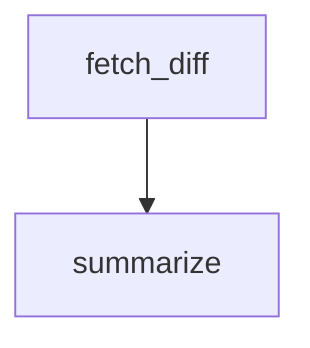

A `tool` node fetches a raw PR diff from the GitHub API, then an agent summarizes the changes. Demonstrates how to chain an HTTP tool node with a downstream agent node using a real external API.

## What it demonstrates

- `tool` node with `tool: http` for external API calls
- Template interpolation in HTTP headers (`{{ env.GITHUB_TOKEN }}`)
- Chaining a tool node to an agent node via an edge
- Passing fetched data through the workflow context to a downstream agent

## Prerequisites

Set a GitHub personal access token with `repo:read` scope:

```bash
export GITHUB_TOKEN=ghp_...
```

## Run it

```bash
sirenspec run docs/cookbook/pr-summarizer/workflow.yaml \
  --input "Summarise this pull request for me."
```

To point at a different PR, edit the `url` in `workflow.yaml` to match your repository and PR number:

```
https://api.github.com/repos/{owner}/{repo}/pulls/{number}
```

## Workflow

```yaml docs/cookbook/pr-summarizer/workflow.yaml
version: "0.1"

agents:
  summarizer:
    model: "openai:gpt-4o-mini"
    system: |
      You are a senior software engineer reviewing a GitHub pull request.
      You will be given the raw unified diff of the pull request.
      Write a concise, developer-friendly summary covering what changed,
      why the change is likely being made, and any notable risks.
      Keep the summary under 200 words.

nodes:
  fetch_diff:
    type: tool
    tool: http
    config:
      url: "https://api.github.com/repos/TJLSmith0831/sirenspec/pulls/1"
      method: GET
      headers:
        Authorization: "Bearer {{ env.GITHUB_TOKEN }}"
        Accept: "application/vnd.github.v3.diff"
        User-Agent: "sirenspec/0.1"
      timeout: 15
    output_key: diff

  summarize:
    agent: summarizer
    writes: output.summary

edges:
  - from: fetch_diff
    to: summarize

guardrails:
  - injection
```

## Graph



## Next steps

<CardGroup cols={2}>
  <Card title="Tool Nodes" href="/tool-nodes">
    Full HTTP and Python tool node documentation.
  </Card>
  <Card title="Blind Code Review" href="/cookbook/blind-code-review">
    Multi-turn refinement: write, review, revise.
  </Card>
</CardGroup>
