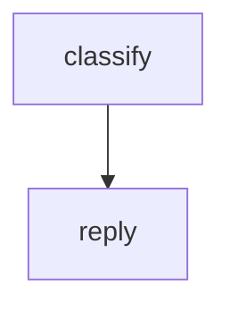

Two agents connected by an edge. The first classifies the user's intent; the second reads that classification from the workflow context and composes a reply. This classify → respond pattern appears in nearly every customer-facing agent workflow.

## What it demonstrates

- Connecting two nodes with an `edge`
- Writing intermediate results to `working.*` context paths
- Mixing providers: OpenAI classifies, Anthropic replies
- Workflow-level `guardrails`

## Run it

```bash
sirenspec run docs/cookbook/sequential-pipeline/workflow.yaml --input "My order hasn't arrived yet."
```

## Workflow

```yaml docs/cookbook/sequential-pipeline/workflow.yaml
version: "0.1"

agents:
  classifier:
    model: "openai:gpt-4o-mini"
    system: |
      Classify the user's message into one of these intents: question, complaint, feedback, other.
      Respond with ONLY the intent label, nothing else.

  replier:
    model: "anthropic:claude-haiku-4-5-20251001"
    system: |
      You are a customer support agent. The user's intent has been classified.
      Compose a short, helpful reply appropriate for that intent.

nodes:
  classify:
    agent: classifier
    writes: working.intent

  reply:
    agent: replier
    writes: output.reply

edges:
  - from: classify
    to: reply

guardrails:
  - injection
  - length
```

<Note>
This workflow mixes providers: OpenAI handles classification, Anthropic writes the reply. Each agent independently resolves its own provider at runtime.
</Note>

## How data flows

1. `classify` receives the user's message and writes a single intent label (e.g. `"complaint"`) to `working.intent`.
2. `reply` receives the output of `classify` as its user message and composes the final response.

## Graph



## Next steps

<CardGroup cols={2}>
  <Card title="Conditional Pipeline" href="/cookbook/conditional-pipeline/README">
    Route to different handlers based on the classification.
  </Card>
  <Card title="Telephone Game" href="/cookbook/telephone-game/README">
    Chain five agents and watch meaning drift.
  </Card>
</CardGroup>
