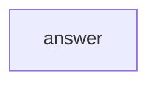

A single agent, one node, no edges. This is the minimum viable SirenSpec workflow and the right starting point before exploring multi-agent patterns.

## What it demonstrates

- Declaring an agent with a model URI and system prompt
- A single `agent` node that writes to `output.reply`
- Running a workflow with a static input and overriding it from the CLI

## Run it

```bash
sirenspec run docs/cookbook/simple-agent/workflow.yaml
# Override the question:
sirenspec run docs/cookbook/simple-agent/workflow.yaml --input "What is the boiling point of water?"
```

## Workflow

```yaml docs/cookbook/simple-agent/workflow.yaml
version: "0.1"

agents:
  assistant:
    model: "openai:gpt-4o-mini"
    system: "You are a helpful assistant. Answer questions clearly and concisely."

nodes:
  answer:
    agent: assistant
    writes: output.reply

input:
  message: "What is the capital of France?"
```

## Graph



## Next steps

<CardGroup cols={2}>
  <Card title="Sequential Pipeline" href="/cookbook/sequential-pipeline">
    Chain two agents together with an edge.
  </Card>
  <Card title="YAML Reference" href="/yaml-reference">
    Every field available in a workflow file.
  </Card>
</CardGroup>
