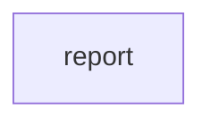

Paste in a messy bug description and get a clean, machine-readable report back. The `schema` guardrail rejects the agent's output if it doesn't conform to the declared JSON Schema — so every report has the same shape, every time.

## What it demonstrates

- `schema` guardrail with a required `config` block
- Enforcing output contracts without post-processing
- `enum` and `maxLength` constraints inside the JSON Schema declaration
- Combining `injection` and `schema` guardrails on a single workflow

## Run it

```bash
sirenspec run docs/cookbook/structured-bug-reporter/workflow.yaml
```

Override with your own bug description:

```bash
sirenspec run docs/cookbook/structured-bug-reporter/workflow.yaml \
  --input "Safari crashes when uploading files > 10 MB on the profile page."
```

## Workflow

```yaml docs/cookbook/structured-bug-reporter/workflow.yaml
version: "0.1"

agents:
  reporter:
    model: "openai:gpt-4o-mini"
    system: |
      You are a QA engineer writing a structured bug report.
      Given a freeform bug description, produce a JSON object with these exact fields:
        title       — short, imperative title (max 80 chars)
        severity    — one of: critical, high, medium, low
        repro_steps — ordered list of steps to reproduce (array of strings)
        expected    — what should happen (string)
        actual      — what actually happens (string)
        labels      — list of relevant labels, e.g. "auth", "ui", "data-loss" (array of strings)

      Return ONLY valid JSON. No explanation, no markdown fences.

nodes:
  report:
    agent: reporter
    writes: output.bug_report

guardrails:
  - injection
  - name: schema
    config:
      schema:
        type: object
        properties:
          title:
            type: string
            maxLength: 80
          severity:
            type: string
            enum: [critical, high, medium, low]
          repro_steps:
            type: array
            items:
              type: string
          expected:
            type: string
          actual:
            type: string
          labels:
            type: array
            items:
              type: string
        required: [title, severity, repro_steps, expected, actual, labels]
```

<Note>
The `schema` guardrail is the only guardrail in SirenSpec that requires a `config` block. Zero-config guardrails like `injection` and `length` can be declared as bare strings. Any guardrail that needs configuration uses the `name:` + `config:` object form.
</Note>

## How data flows

1. The user's freeform bug description is sent to `reporter` as the user message.
2. `reporter` produces a JSON object conforming to the declared schema.
3. The `schema` guardrail validates the output before it is written to `output.bug_report`. If the output is missing a required field or violates a constraint (e.g. `severity` is not one of the four allowed values), the guardrail raises a `GuardrailViolation` and the workflow fails.

## Graph



## Next steps

<CardGroup cols={2}>
  <Card title="Guardrails" href="/guardrails">
    Full reference for injection, length, PII, schema, and cost-cap guardrails.
  </Card>
  <Card title="Content Moderation Pipeline" href="/cookbook/content-moderation-pipeline/README">
    Nested workflows with injection and PII guardrails applied in layers.
  </Card>
</CardGroup>
